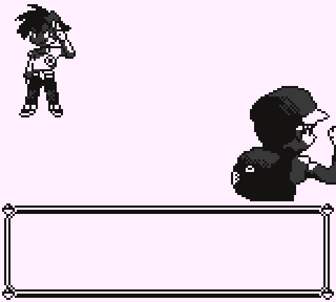

# RAManimator – Animate graphics in emulated games

RAManimator is a collection of scripts to animate graphics in Gameboy and Gameboy Advance games emulated via the mGBA emulator. It works by manipulating the memory while the games run, so it can easily be adapted to new games or modern hacks. New animations can be added through Aseprite or as GIFs. Currently, animations are provided for all main-line Pokémon games on these platforms.

 

## Supported games
RAManimator comes with partial animations for all mainline Pokémon games of generations 1, 2 and 3. Supported features and included animations depend on the generation. It is designed such that hacks of all of these games can be accomodated, though that will require some setup and might not work perfectly. Other games can also be animated, though that naturally requires work.

| Generation | 1 | 2 | 3 | Gen 3 Hacks |
| ---------- |---|---|---| ----- |
| Front sprites | 32 / 151 in Red & Blue style, others can use Gen 2 animations | 251 / 251, animations are modified loops of those in Crystal | 277 / 420, ported over from Black and White | 495 / 1478, ported over from Black and White |
| Back sprites | 32 / 151 Crystal back sprites, others use Crystal back sprites without animation | 32 / 251, same as for Gen 1 | 270 / 420, ported over from Black and White | 485 / 1478, ported over from Black and White |
| Extras | 14 trainers | - | - | - |
| Color support | [No*](#colors-for-gameboy-games) | [No*](#colors-for-gameboy-games) | Yes | Yes |

For generation 1, RAManimator places the sprites from Crystal by default, though the colors [do not work with mGBA 0.10.5](#colors-for-gameboy-games). 32 front and back sprites as well as some trainers got animated by hand. This includes all monsters that can be found up to the first gym badge, all starter evolutions and some arbitrary extras. [This video](https://youtu.be/dePWJTkMb9A) displays all of them. A few monsters have special animations for when they are low on HP or fainted; for example, the flame on Charmander's tail wanes as its HP decrease.

In generation 2, the front sprites are slightly adapted loops of the Crystal intro animations. The 32 Kanto monster back sprites are animated as well, but no extras.

For generation 3, the animated sprites from the fifth generation were ported over insofar that was possible. Generation 3 sprites can only be 64x64 pixels large, but gen 5 sprites may fill up to 96x96 pixels. For many small and intermediate monsters, I could just port them over directly. I added a number of intermediate monsters that could fit into the frame with minor modifications, but many late-game monsters are not animated. [This video](https://youtu.be/kphyiA4KuBw) displays all included animations. 

Since many modern hacks feature monsters of later generations, RAManimator includes ports of many gen 4 and 5 monsters' Black and White animations.

## Quick start
Download the software. If you have Git, clone this repository, otherwise download the release above and unpack.

Install and open [mGBA](https://mgba.io/), at least version 0.10.5. Open a [Pokémon game](#supported-games) of your choice (don't start with a hack), for example English Pokémon Emerald. In mGBA, open `Tools -> Scripting`. In the new window under `File`, select `Load Script`. Navigate to the directory where you put the RAManimator files. In the folder `luascripts`, select `startup.lua`. The scripts might take a few seconds to load. When you start a battle early in the game, the monsters will now be animated.

Official games should work in any language out of the box. To set up hacks, [check here](docs/hacksetup.md).

## How it works
RAManimator consists of three main components: slots, hooks and animations. Since these terms come up when using the program, here is a quick primer:

Slots are different locations that graphics can appear in. In Pokémon, we have front and back slots; a back sprite cannot appear in a front slot and vice-versa. Slots contain extra information, such as where to find the colors for a sprite. You can think of them as a rectangle on screen in which graphics appear.

Hooks are the graphics that the game normally displays. RAManimator has a list of graphics that it knows and can animate, e.g. a Bulbasaur sprite or Charmander. If one of them turns up in its slot, RAManimator will simply replace it with the animation's frames in memory. This only works if the hooks contain precisely the right graphics: If you play Red or Blue, RAManimator will load a different set of hooks than when you play Yellow. This is the most finicky part with hacks, since many of them change sprites, so RAManimator doesn't recognize them. [This can be fixed](docs/updatehooks.md).

Finally, animations are the collections of images that will be placed once a hook has been detected. They can consist of several strips to make them more dynamic.

## How-tos and documentation
RAManimator comes with a variety of features, both for users who want to make it work with their favorite hacks and animators who want to put their creations into the games. If you have any problem, please check whether it is addressed [here](docs/README.md).

## Contributing
Naturally, RAManimator is only as good as the animations it includes. If you are a sprite artist, I would much appreciate contributed animations. Please check [here](docs/README.md) for how RAManimator can help you when creating animations and how you can submit them to the repository.

## Colors for Gameboy games
mGBA 0.10.5 does not support manipulating color palettes via scripting. This means that animations in Gameboy games need to use the same color palettes as the sprites they are replacing, so the gen 2 sprites in gen 1 games will look unusual. Generation 3 games process colors internally in a different way, so they can be intercepted and work out of the box.

I implemented scripting access to palettes in a [modified version](https://github.com/Jengolus/mgba) of mGBA. At the time of this writing, these commands have not yet been merged into the main branch. If you are comfortable compiling software yourself, you can compile and use the fork for full color support. In addition to looking nice, this will add a tint to color palettes in gens 1 and 2 if a monster is affected by a status condition, like they do in gen 5.

## License

The source code is licensed under the BSD-2-Clause license. The image data contained in `luascripts/ramanimator/data` has its own license contained in that folder.

## Credits

The ports of Black and White animations to generation 3 are based on the GIFs provided by [Pokémon Database](https://pokemondb.net/).

The hooks for mainline games are generated from the [pret repositories](https://github.com/pret) using [these scripts](https://www.github.com/Jengolus/ramanimator-tools).

The hooks for modern gen 3 hacks are generated from the [emerald expansion repository](https://github.com/rh-hideout/pokeemerald-expansion), which in turn credits [this thread](https://www.pokecommunity.com/threads/gen-vi-ds-style-64x64-pokemon-sprite-resource.314422/) and [this one](https://www.pokecommunity.com/threads/ds-style-gen-vii-and-beyond-pok%C3%A9mon-sprite-repository-in-64x64.368703/).

Pokémon images & names © 1995-2026 Nintendo/Game Freak.
